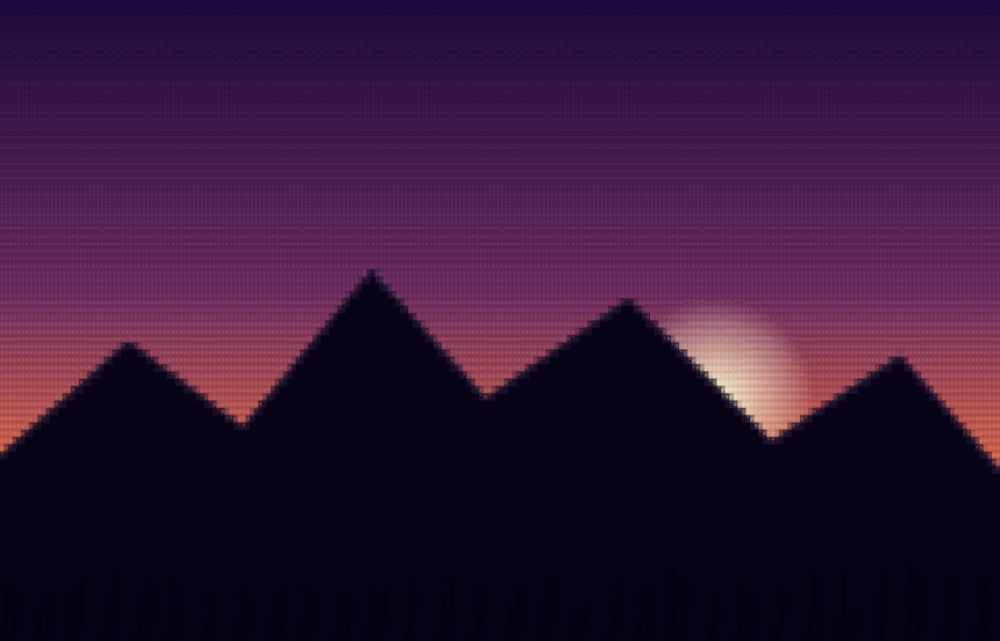
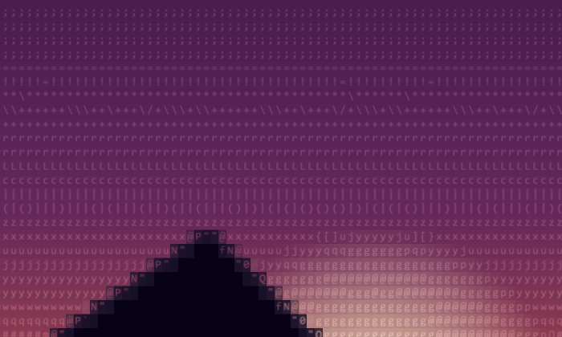

# GLYPHFORGE

[](https://github.com/Kaushik2210/GLYPHFORGE/actions/workflows/ci.yml)


**A GPU-native ASCII art engine for the browser.** GLYPHFORGE converts photos into character grids through a perceptual glyph matcher — not the brightness-ramp trick every other converter uses — so the output reads as an actual picture, not scratchy noise. Every pixel decision runs through a real color-science and pattern-matching pipeline: linear-light math, perceptual (Oklab) color clustering, structure-correlated glyph selection, and a GPU-instanced renderer that draws the whole grid in a single draw call.

**[Live demo →](https://glyphforge-web.vercel.app)** · **[Study guide for presenting this project →](https://claude.ai/code/artifact/a17dcaad-fedf-4320-85e1-5f6ed9256b92)**

## Screenshots

A photo converted end-to-end — smooth gradient sky, a hard-edged silhouette, and fine grass texture, all in the same frame:



Zoomed into the mountain ridge — this is real, selectable text. Each glyph (`I`, `l`, `c`, `z`, `x`, `w`, punctuation) was chosen because its printed shape matches the light/dark pattern of that patch of sky, not because of a brightness lookup:



## Why this is different from other ASCII converters

Nearly every "image to ASCII" tool — the CLI ones, the online ones, the ones bundled into image editors — does the same thing: measure a tile's average brightness, then index into a fixed ramp string like `" .:-=+*#%@"`. It's fast and it's simple, and it's also why their output usually looks like static instead of a picture: **two completely different-looking patches can share the same average brightness**, so a smooth gradient and a scratchy texture render identically.

| | Typical ASCII converter | GLYPHFORGE |
|---|---|---|
| **Character selection** | Average brightness → fixed ramp lookup | Cross-correlation against every candidate glyph's actual pixel pattern — shape-aware, not brightness-only |
| **Color** | One flat color per cell, or none | Two colors per cell (foreground/background), solved by clustering — hard edges stay sharp instead of blurring |
| **Color math** | Raw sRGB values averaged directly | Linear-light conversion first, then perceptual (Oklab) clustering — matches how brightness and color actually combine and how eyes perceive difference |
| **Noise handling** | None — sensor grain and gradient dithering get matched as if they were real detail | A calibrated denoise pass, tuned by *measuring* the separation between real noise and real edges rather than guessing |
| **Resolution** | Usually a fixed column count regardless of screen or image | Computed live from available screen space for the preview, and independently maximized for downloads — never blurred, never needs scrolling |
| **Rendering** | Draws each character individually (slow past a few thousand cells) | One GPU-instanced draw call for the entire grid, the same technique game engines use for crowds of identical sprites |
| **Tuning process** | Mostly eyeballed | Every threshold is backed by a written measurement — noise vs. signal separation, fidelity before/after — checked into the test suite as a permanent regression guard |

## Why this matters

**It's a real engineering exercise disguised as a novelty converter.** The moment you commit to matching by *shape* instead of *brightness*, you inherit an entire stack of hard, real problems: color science (RGB isn't how eyes perceive color — Oklab is), signal processing (how do you tell sensor noise from real detail before it corrupts a nearest-neighbour search?), and real-time graphics performance (how do you draw 30,000+ characters without the browser choking?). GLYPHFORGE doesn't stop at "it looks cool" — it treats each of those as a problem to actually solve and verify, not paper over.

**The output is usable, not just a gimmick.** Because character selection is driven by real structure, the result stays legible at a glance instead of degrading into visual noise the way brightness-ramp converters do on anything but the simplest images — so it's viable for actual retro-aesthetic graphics, terminal splash art, or social content, not just a tech demo.

**Every fix is backed by a measurement, not a guess.** When a bug was reported ("this looks blurry," "gradients look noisy"), the response wasn't a visual tweak-and-hope — it was writing a small script to *measure* the actual signal (how much does real noise separate from a real edge, numerically?) and picking a threshold with real margin on both sides, checked into the test suite so it can't silently regress. That discipline is the difference between a demo that happens to look right today and a system that's actually understood.

## Try it

- **Drag and drop** an image onto the live preview, or click to browse
- Pick a style preset (**Balanced**, **Photographic**, **Technical**, **Dramatic**, **Classic**) — each rebalances the structure/tone/edge weights differently
- **Export** as PNG, plain text, or ANSI (with real terminal color codes) — exports render at the pipeline's full detail ceiling, independent of your screen size
- Fully responsive — fits any screen from phone to ultrawide monitor without scrolling or blur

## Tech stack

| | |
|---|---|
| **Framework** | React 19 + Vite 6 + TypeScript 5.7 (strict) |
| **Rendering** | WebGL2 instanced rendering |
| **State** | Zustand |
| **Testing** | Vitest |
| **Package management** | pnpm workspaces (monorepo) |
| **Deployment** | Vercel (auto-deploys on push to `main`) |

## Architecture

```
packages/core   zero-DOM, zero-React glyph matching / color / edge-detection engine — runs in Node
packages/gpu    WebGL2 rendering backend, glyph atlas rasterization
apps/web        React UI — owns pixels and events only, imports everything else
bench/          performance and fidelity benchmarking harness
```

Layer boundaries are enforced by `eslint-plugin-boundaries` — `core` never imports from `gpu` or `apps/web`, so the matching engine stays testable in plain Node with no browser APIs.

### Core invariants

- **Linear light math.** All image math happens in linear RGB; sRGB conversion only at the input/output boundary.
- **One quantization step.** `Glyphify` is the only place the pipeline becomes discrete — effects never chain glyph→glyph.
- **Determinism.** Same seed + same frame index produces bit-identical output. No `Math.random()` or wall-clock reads in the core matching pipeline.
- **Every algorithm has a CPU reference implementation**, tested independently of any GPU path.

## Getting started

Requires Node ≥20 and [pnpm](https://pnpm.io).

```bash
git clone https://github.com/Kaushik2210/GLYPHFORGE.git
cd GLYPHFORGE
pnpm install
pnpm dev
```

Open the printed local URL — the dev server runs the `apps/web` package on Vite.

### Scripts

| Command | Description |
|---|---|
| `pnpm dev` | Start the web app's dev server |
| `pnpm build` | Build all packages |
| `pnpm test` | Run the full test suite (Vitest) |
| `pnpm typecheck` | Type-check every workspace package |
| `pnpm lint` | Lint the whole repo (ESLint, `--max-warnings 0`) |
| `pnpm bench` | Run performance benchmarks |
| `pnpm fidelity` | Measure conversion fidelity (SSIM) against reference fixtures |

## Quality bar

Every PR is expected to pass `pnpm typecheck`, `pnpm lint`, and `pnpm test` before merging. Changes to the matcher, color pipeline, or charsets are expected to report before/after fidelity numbers rather than relying on visual judgement alone — see `CLAUDE.md` for the full set of engineering invariants this project holds itself to.

## License

All rights reserved. This code is public for portfolio/reference purposes; it is not licensed for reuse, modification, or redistribution.
